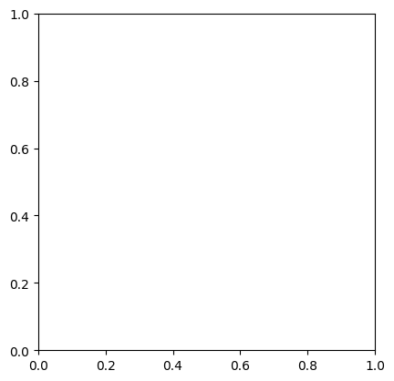
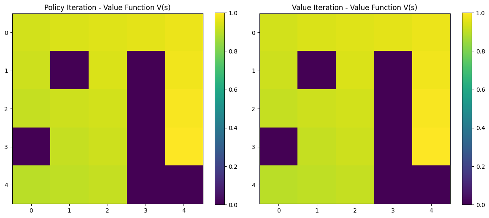

# Gym Environment Setup & Video Recording | إعداد بيئات Gym وتسجيل الفيديو

    

## نظرة عامة (Overview)

إعداد بيئات Gymnasium الافتراضية (Xvfb) وتسجيل الفيديو للحلقات (episodes) لعرض تصرف العميل.

Sets up virtual-display Gymnasium environments and records episode videos to visualize agent behaviour.

## الأدوات والمكتبات (Tech Stack)

`IPython`, `base64`, `gym`, `gymnasium`, `matplotlib`, `numpy`, `os`, `pandas`, `pyvirtualdisplay`, `time`

## نتائج مرئية (Visual Outputs)

## محتويات المجلد (Notebooks in this folder)

- **`Untitled11.ipynb`** — 4 خلية (cells)
- **`Untitled27.ipynb`** — 4 خلية (cells)

> 📌 يحتوي هذا المجلد على أكثر من نسخة/تجربة لنفس المشروع (خطوات تطوير متتالية أو نسخ تدريبية)، تم تجميعها معًا لأنها تمثل نفس الفكرة البحثية.

> 📌 This folder bundles multiple versions/iterations of the same project (successive development steps or lab copies), grouped together as they represent the same research idea.
