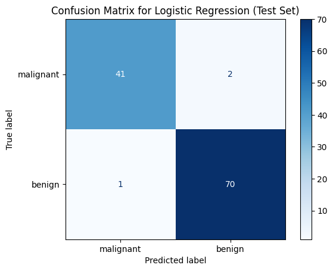
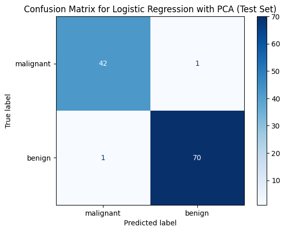

# Breast Cancer Diagnosis | تشخيص سرطان الثدي (Breast Cancer Diagnosis)

  

## نظرة عامة (Overview)

نموذج تصنيف ثنائي (حميد/خبيث) على بيانات Breast Cancer Wisconsin مع معالجة البيانات وتقييم شامل للنموذج.

A binary classifier (benign/malignant) trained on the Breast Cancer Wisconsin dataset with full preprocessing and evaluation.

## خطوات العمل الأساسية (Key Steps)

- Applying Principal Component Analysis (PCA)
- Retraining Logistic Regression with PCA-transformed Data
- Visualizing the Confusion Matrix for PCA-transformed Data
- Optimizing PCA Components with Grid Search
- Evaluating the Best Model from Grid Search

## الأدوات والمكتبات (Tech Stack)

`matplotlib`, `pandas`, `sklearn`

## النتائج (Sample Results)

| Metric | Value (sample) |
|---|---|
| Accuracy | 0.97 |
| accuracy | 0.98 |

> *ملاحظة: القيم أعلى مستخرجة تلقائيًا من مخرجات الدفاتر الأصلية كعيّنة على أداء النموذج خلال التدريب/الاختبار.*

## نتائج مرئية (Visual Outputs)

## محتويات المجلد (Notebooks in this folder)

- **`breast_cancer.ipynb`** — 17 خلية (cells)
