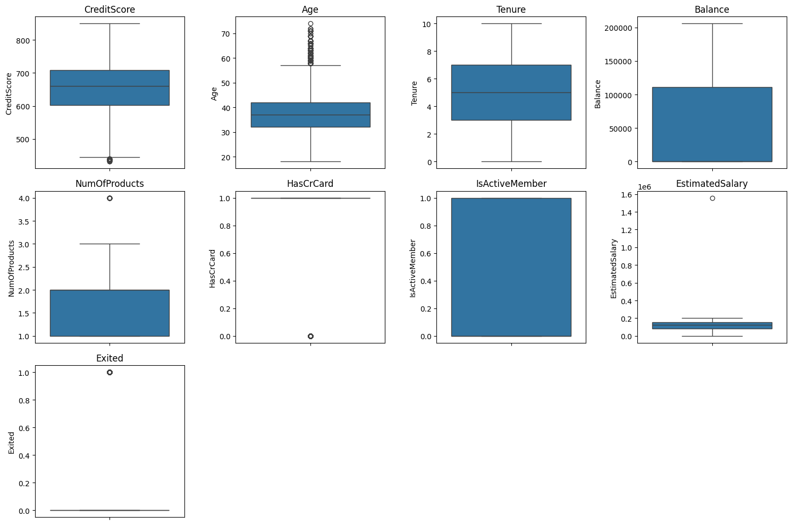
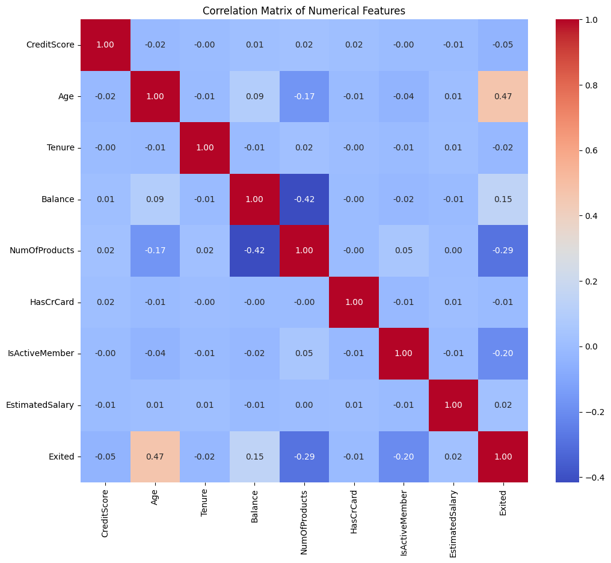

# Customer Churn Prediction | التنبؤ بمغادرة العملاء (Customer Churn Prediction)

       

## نظرة عامة (Overview)

مشروع تحدي تدريبي للتنبؤ بمغادرة العملاء (Churn) اعتمادًا على بيانات الاستخدام والتعاملات.

An internship-challenge project predicting customer churn from usage and transaction data.

## خطوات العمل الأساسية (Key Steps)

- Exploring Categorical Features
- Checking for Outliers
- Correlation Matrix and Heatmap
- Checking Target Variable (Exited) Balance
- Splitting Data into Training and Testing Sets with Stratified Sampling
- XGBoost Model
- LightGBM Model
- Random Forest Model

## الأدوات والمكتبات (Tech Stack)

`imblearn`, `lightgbm`, `matplotlib`, `numpy`, `pandas`, `seaborn`, `sklearn`, `xgboost`

## النتائج (Sample Results)

| Metric | Value (sample) |
|---|---|
| Precision | 0.5874 |
| Recall | 0.5946 |
| F1-score | 0.5907 |
| Accuracy | 0.8351 |
| Precision | 0.7790 |
| Recall | 0.6795 |

> *ملاحظة: القيم أعلى مستخرجة تلقائيًا من مخرجات الدفاتر الأصلية كعيّنة على أداء النموذج خلال التدريب/الاختبار.*

## نتائج مرئية (Visual Outputs)

## محتويات المجلد (Notebooks in this folder)

- **`ML Internship Challenge_ Predict Customer Churn.ipynb`** — 75 خلية (cells)
