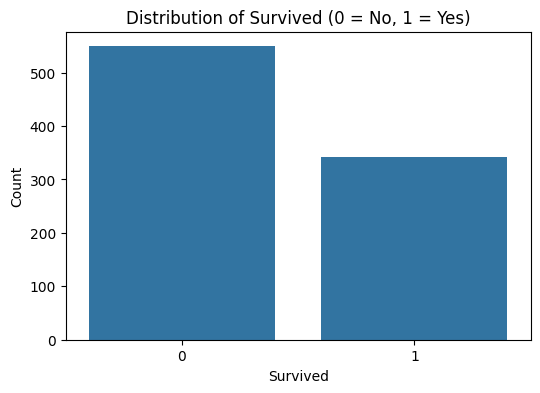
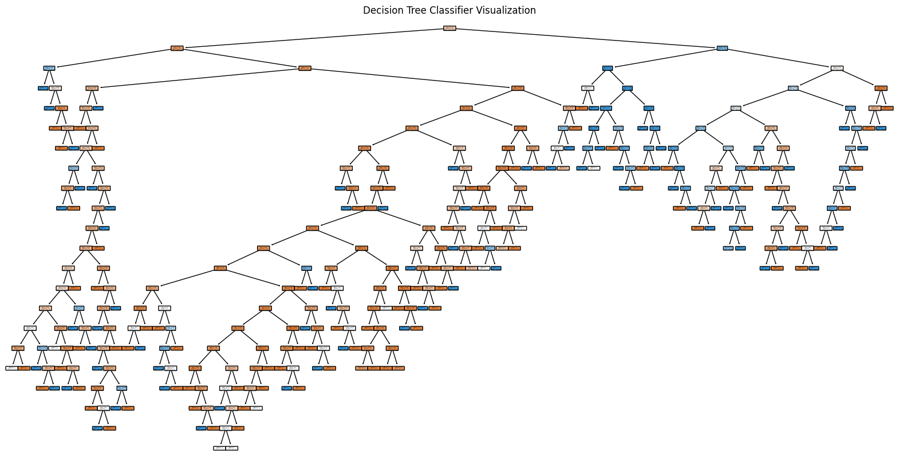

# Ensemble Trees Classification | نماذج الأشجار التجميعية (Random Forest / Decision Tree Ensemble)

     

## نظرة عامة (Overview)

مقارنة أداء Decision Tree وRandom Forest وطرق التجميع (Ensemble) على مهام تصنيف مختلفة.

Compares Decision Tree, Random Forest, and ensemble techniques across classification tasks.

## خطوات العمل الأساسية (Key Steps)

- Decision Tree Classifier
- Hyperparameter Tuning with GridSearchCV
- Evaluate the Best Model
- Applying SMOTE to Balance Training Data and Retraining the Model
- Bagging Classifier with Logistic Regression
- Bagging Classifier with Decision Tree
- Random Forest Classifier
- Bagging Classifier with Random Forest

## الأدوات والمكتبات (Tech Stack)

`imblearn`, `matplotlib`, `numpy`, `pandas`, `seaborn`, `sklearn`

## النتائج (Sample Results)

| Metric | Value (sample) |
|---|---|
| accuracy | 0.8118 |
| Accuracy | 0.9916 |
| Accuracy | 0.9023 |
| accuracy | 0.9098 |
| Accuracy | 0.9227 |
| Accuracy | 0.9203 |
| Accuracy | 0.9639 |

> *ملاحظة: القيم أعلى مستخرجة تلقائيًا من مخرجات الدفاتر الأصلية كعيّنة على أداء النموذج خلال التدريب/الاختبار.*

## نتائج مرئية (Visual Outputs)

## محتويات المجلد (Notebooks in this folder)

- **`RD_DT_ensemble.ipynb`** — 34 خلية (cells)
- **`lab2.ipynb`** — 22 خلية (cells)

> 📌 يحتوي هذا المجلد على أكثر من نسخة/تجربة لنفس المشروع (خطوات تطوير متتالية أو نسخ تدريبية)، تم تجميعها معًا لأنها تمثل نفس الفكرة البحثية.

> 📌 This folder bundles multiple versions/iterations of the same project (successive development steps or lab copies), grouped together as they represent the same research idea.
