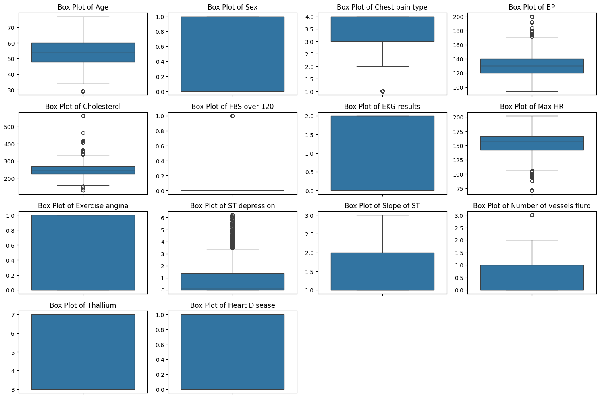
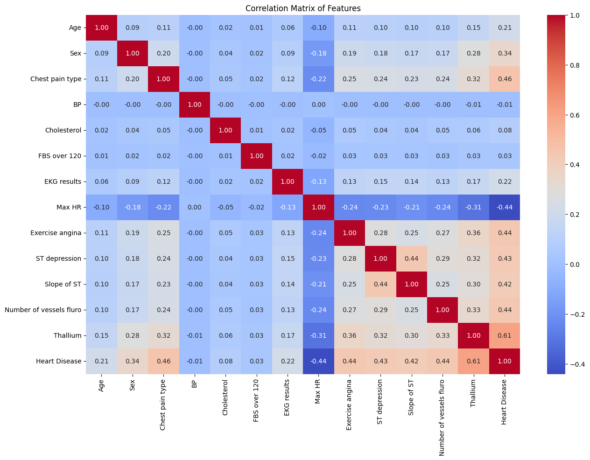

# Heart Disease Prediction | التنبؤ بأمراض القلب (Heart Disease Prediction)

      

## نظرة عامة (Overview)

نموذج تصنيف للتنبؤ باحتمالية الإصابة بمرض القلب بناءً على المؤشرات الصحية للمريض.

A classification model predicting the likelihood of heart disease from patient health indicators.

## خطوات العمل الأساسية (Key Steps)

- Classification Report for Training Set
- Classification Report for Test Set
- LightGBM Model Training
- LightGBM Classification Report for Training Set
- LightGBM Classification Report for Test Set
- Model Comparison and Visualization
- ROC Curve Comparison
- Making Predictions on `test.csv` and Creating Submission File

## الأدوات والمكتبات (Tech Stack)

`lightgbm`, `matplotlib`, `numpy`, `pandas`, `seaborn`, `sklearn`, `xgboost`

## النتائج (Sample Results)

| Metric | Value (sample) |
|---|---|
| Accuracy | 0.8914 |
| Precision | 0.8727 |
| Recall | 0.8871 |
| F1-Score | 0.8799 |
| Accuracy | 0.8890 |
| Precision | 0.8706 |

> *ملاحظة: القيم أعلى مستخرجة تلقائيًا من مخرجات الدفاتر الأصلية كعيّنة على أداء النموذج خلال التدريب/الاختبار.*

## نتائج مرئية (Visual Outputs)

## محتويات المجلد (Notebooks in this folder)

- **`Predicting Heart Disease.ipynb`** — 43 خلية (cells)
