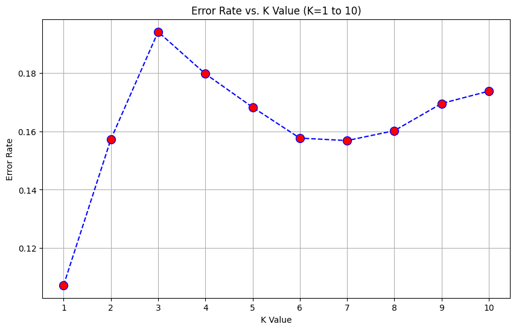
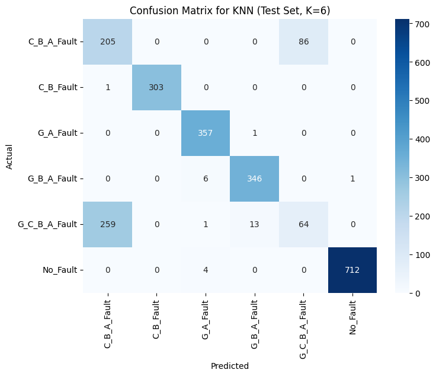

# KNN Classifier | تصنيف باستخدام خوارزمية أقرب الجيران (KNN)

    

## نظرة عامة (Overview)

بناء وتقييم مصنّف K-Nearest Neighbors مع تجربة قيم مختلفة لعدد الجيران (k) لمعرفة أثرها على الدقة.

Implements and evaluates a K-Nearest Neighbors classifier, sweeping different values of k to study their effect on accuracy.

## الأدوات والمكتبات (Tech Stack)

`matplotlib`, `numpy`, `pandas`, `seaborn`, `sklearn`

## النتائج (Sample Results)

| Metric | Value (sample) |
|---|---|
| Accuracy | 0.8928 |
| Accuracy | 0.8427 |
| Accuracy | 0.8058 |
| Accuracy | 0.8203 |
| Accuracy | 0.8317 |
| Accuracy | 0.8423 |

> *ملاحظة: القيم أعلى مستخرجة تلقائيًا من مخرجات الدفاتر الأصلية كعيّنة على أداء النموذج خلال التدريب/الاختبار.*

## نتائج مرئية (Visual Outputs)

## محتويات المجلد (Notebooks in this folder)

- **`KNN.ipynb`** — 13 خلية (cells)
