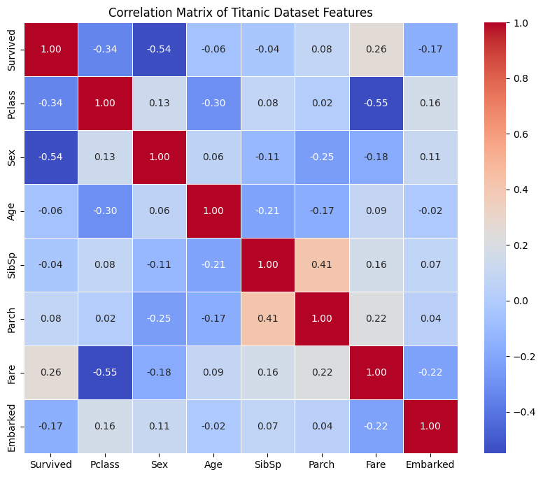
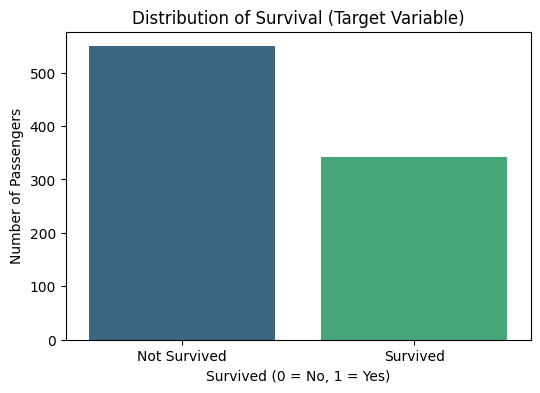

# Titanic Survival Classification | التنبؤ بالنجاة في تايتانيك (Titanic Survival)

       

## نظرة عامة (Overview)

تمرين تصنيف كلاسيكي للتنبؤ بنجاة ركاب تايتانيك، يتضمن هندسة ميزات (Family Size, IsAlone) وأشجار قرار وGrid Search.

The classic Titanic survival exercise, including feature engineering (FamilySize, IsAlone), decision trees, and grid-search tuning.

## خطوات العمل الأساسية (Key Steps)

- Feature Engineering
- Train a Decision Tree Classifier
- Evaluate Model Performance
- Visualize Confusion Matrix
- Decision Tree Visualization
- Grid Search for Decision Tree `max_depth`
- Evaluate Decision Tree with Best `max_depth`
- Classification Report for Optimized Model

## الأدوات والمكتبات (Tech Stack)

`keras`, `lightgbm`, `matplotlib`, `numpy`, `pandas`, `seaborn`, `sklearn`, `xgboost`

## النتائج (Sample Results)

| Metric | Value (sample) |
|---|---|
| Accuracy | 0.9874 |
| Accuracy | 0.8045 |
| Accuracy | 0.8315 |
| Accuracy | 0.8975 |
| Accuracy | 0.8324 |
| accuracy | 0.7850 |
| accuracy | 0.6169 |
| loss | 10.5511 |

> *ملاحظة: القيم أعلى مستخرجة تلقائيًا من مخرجات الدفاتر الأصلية كعيّنة على أداء النموذج خلال التدريب/الاختبار.*

## نتائج مرئية (Visual Outputs)

## محتويات المجلد (Notebooks in this folder)

- **`Untitled13.ipynb`** — 80 خلية (cells)
- **`Untitled14.ipynb`** — 12 خلية (cells)
- **`Untitled16.ipynb`** — 32 خلية (cells)

> 📌 يحتوي هذا المجلد على أكثر من نسخة/تجربة لنفس المشروع (خطوات تطوير متتالية أو نسخ تدريبية)، تم تجميعها معًا لأنها تمثل نفس الفكرة البحثية.

> 📌 This folder bundles multiple versions/iterations of the same project (successive development steps or lab copies), grouped together as they represent the same research idea.
