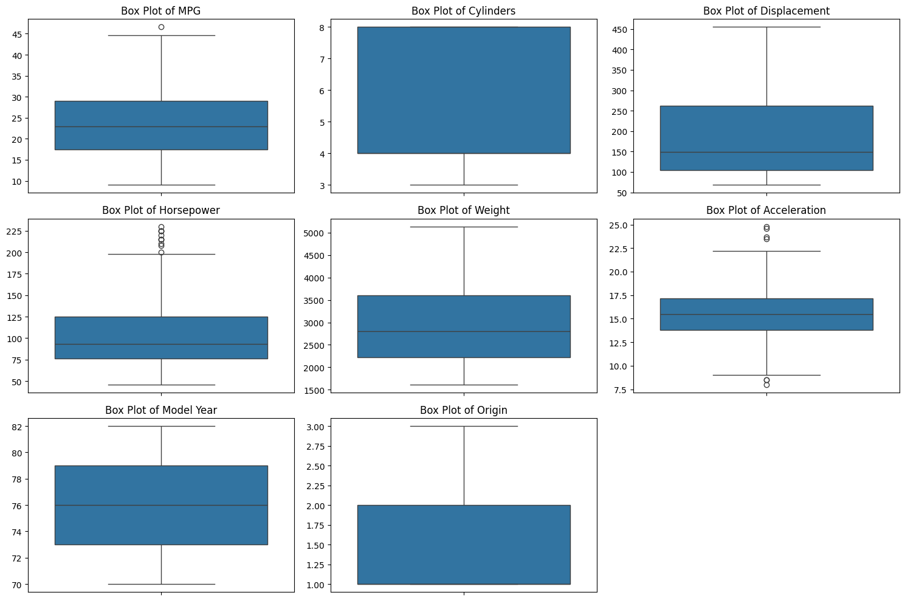
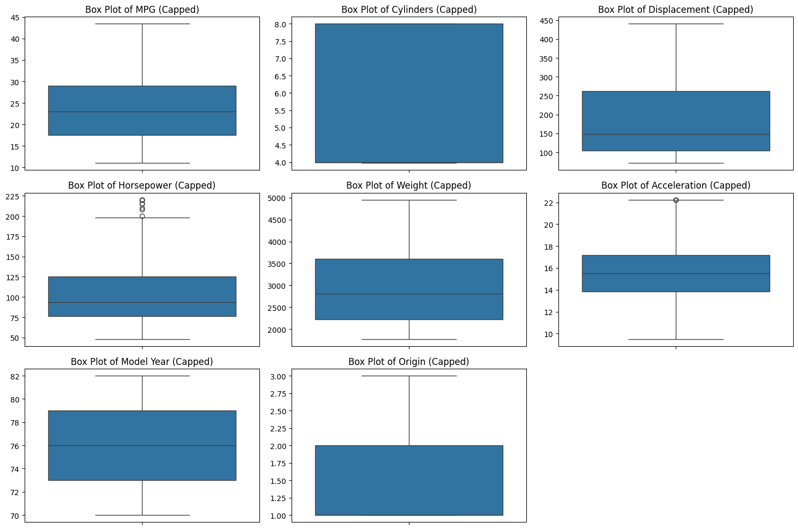

# Auto-MPG Regression Analysis | تحليل وتنبؤ استهلاك الوقود (Auto-MPG Regression)

    

## نظرة عامة (Overview)

تنظيف بيانات Auto-MPG (القيم الشاذة، القيم المفقودة) وبناء نماذج Linear/Polynomial Regression للتنبؤ باستهلاك الوقود.

Cleans the Auto-MPG dataset (outliers, missing values) and builds linear/polynomial regression models to predict fuel consumption.

## خطوات العمل الأساسية (Key Steps)

- Resolving Remaining Outliers in 'Horsepower'
- Data Splitting
- Data Normalization
- Linear Regression Model Training and Evaluation
- Polynomial Regression
- Comprehensive Model Evaluation: Training vs. Test Performance
- Save Data to Google Drive
- Read Data

## الأدوات والمكتبات (Tech Stack)

`google`, `matplotlib`, `numpy`, `os`, `pandas`, `seaborn`, `sklearn`

## النتائج (Sample Results)

| Metric | Value (sample) |
|---|---|
| MAE | 2.894 |
| MSE | 13.740 |
| RMSE | 3.707 |
| MAE | 2.187 |
| MSE | 9.284 |
| RMSE | 3.047 |

> *ملاحظة: القيم أعلى مستخرجة تلقائيًا من مخرجات الدفاتر الأصلية كعيّنة على أداء النموذج خلال التدريب/الاختبار.*

## نتائج مرئية (Visual Outputs)

## محتويات المجلد (Notebooks in this folder)

- **`data_processing_NTI.ipynb`** — 51 خلية (cells)
- **`NTI_Task1.ipynb`** — 73 خلية (cells)

> 📌 يحتوي هذا المجلد على أكثر من نسخة/تجربة لنفس المشروع (خطوات تطوير متتالية أو نسخ تدريبية)، تم تجميعها معًا لأنها تمثل نفس الفكرة البحثية.

> 📌 This folder bundles multiple versions/iterations of the same project (successive development steps or lab copies), grouped together as they represent the same research idea.
