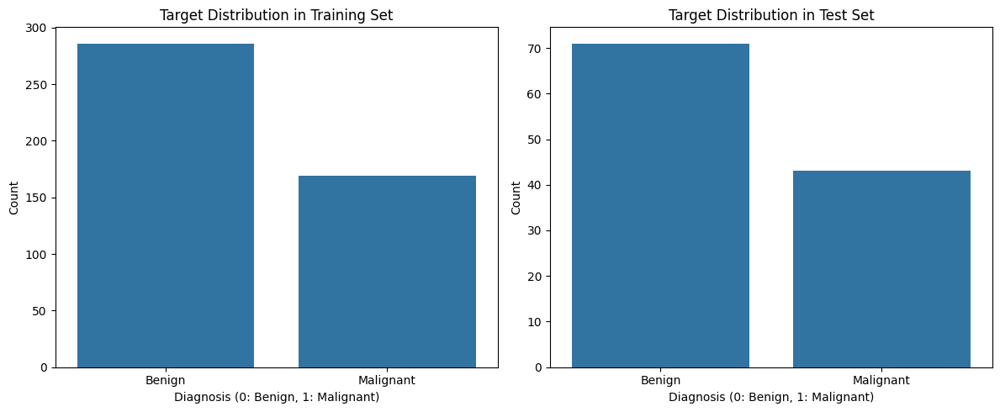

# Logistic Regression Fundamentals | أساسيات الانحدار اللوجستي (Logistic Regression)

    

## نظرة عامة (Overview)

مجموعة تمارين تأسيسية على Logistic Regression لمهام التصنيف الثنائي مع تقييم الدقة.

A set of foundational exercises applying Logistic Regression to binary classification tasks.

## الأدوات والمكتبات (Tech Stack)

`google`, `matplotlib`, `numpy`, `pandas`, `seaborn`, `sklearn`

## النتائج (Sample Results)

| Metric | Value (sample) |
|---|---|
| Accuracy | 0.9737 |
| Accuracy | 0.9940 |

> *ملاحظة: القيم أعلى مستخرجة تلقائيًا من مخرجات الدفاتر الأصلية كعيّنة على أداء النموذج خلال التدريب/الاختبار.*

## نتائج مرئية (Visual Outputs)

## محتويات المجلد (Notebooks in this folder)

- **`Copy of NTI_logistic_Regression.ipynb`** — 14 خلية (cells)
- **`Copy of log reg.ipynb`** — 13 خلية (cells)
- **`Copy of Untitled3.ipynb`** — 10 خلية (cells)
- **`NTI_logistic_Regression.ipynb`** — 1 خلية (cells)

> 📌 يحتوي هذا المجلد على أكثر من نسخة/تجربة لنفس المشروع (خطوات تطوير متتالية أو نسخ تدريبية)، تم تجميعها معًا لأنها تمثل نفس الفكرة البحثية.

> 📌 This folder bundles multiple versions/iterations of the same project (successive development steps or lab copies), grouped together as they represent the same research idea.
