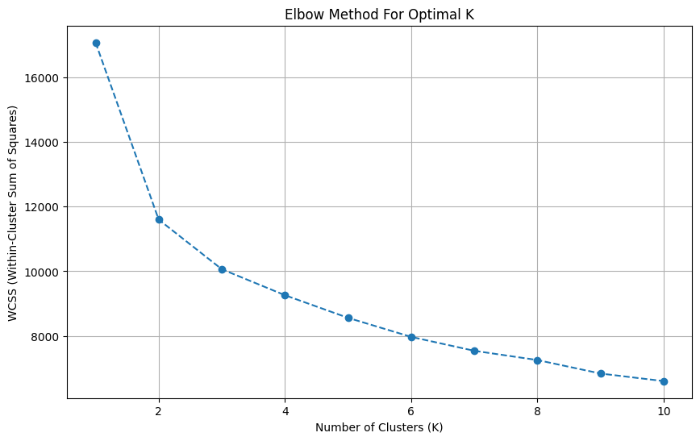
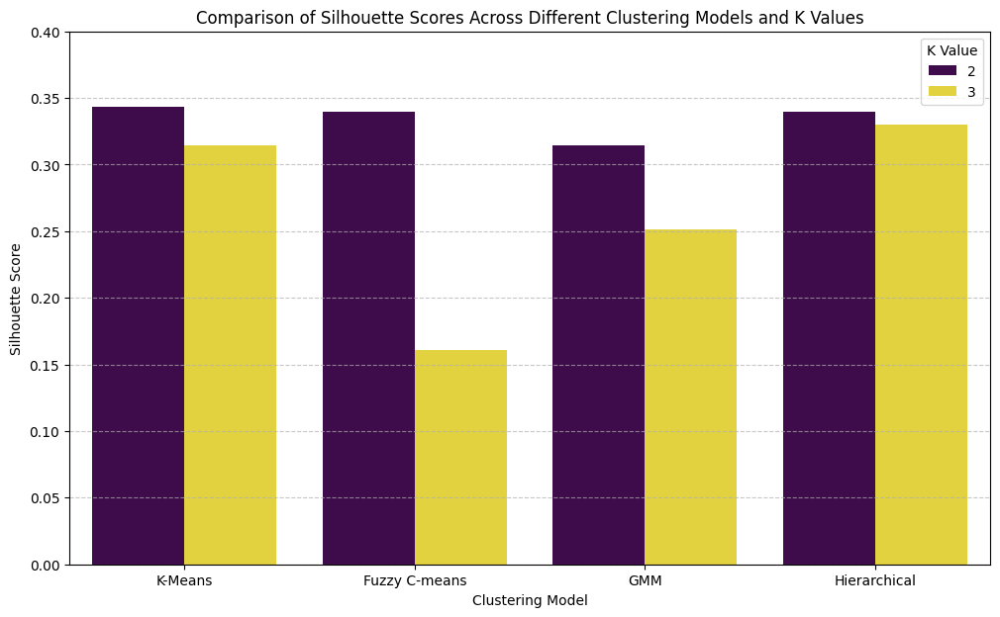

# K-Means Clustering Analysis | تحليل التجميع (Clustering) باستخدام K-Means

    

## نظرة عامة (Overview)

تطبيق خوارزميات التجميع (K-Means وغيرها) لاكتشاف الأنماط والمجموعات الطبيعية داخل البيانات دون تصنيفات مسبقة.

Applies K-Means and related clustering algorithms to discover natural groupings in unlabeled data.

## الأدوات والمكتبات (Tech Stack)

`fcmeans`, `matplotlib`, `numpy`, `pandas`, `seaborn`, `sklearn`

## نتائج مرئية (Visual Outputs)

## محتويات المجلد (Notebooks in this folder)

- **`Clustering.ipynb`** — 17 خلية (cells)
